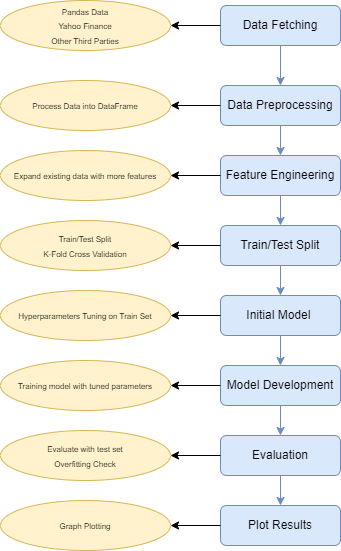

# Machine Learning For Trading Strategies

- Data Engineering
- Feature Selection/Engineer
- Unsupervised Learning
- Supervised Learning
- Deep Learning
- Reinforcement learning
- Natural Language Processing

